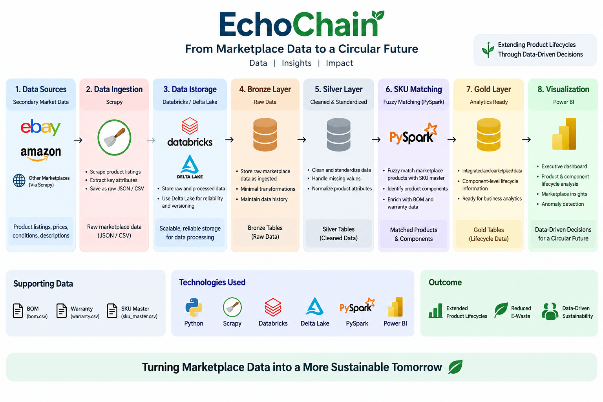

# EchoChain Architecture

## High-Level Architecture

EchoChain follows an end-to-end data engineering and analytics pipeline that combines secondary-market marketplace data with internal product, BOM, and warranty information.



## Architecture Flow

```text
Secondary Market Data
        |
        v
      Scrapy
        |
        v
 Raw Marketplace Data
        |
        v
 Databricks / Delta Lake
        |
        v
      Bronze
        |
        v
     PySpark
        |
        v
      Silver
        |
        v
 SKU Extraction &
 Fuzzy Matching
        |
        v
 Marketplace + BOM + Warranty
        |
        v
       Gold
        |
        v
     Power BI
        |
        v
Executive Lifecycle Analytics
```

## Key Components

### Secondary-Market Data

Marketplace listing data provides information such as product title, price, condition, seller, location, and listing URL.

### Scrapy

Scrapy is used to support marketplace data collection through Python spiders.

### Databricks and Delta Lake

Databricks provides the lakehouse environment for processing and storing the data using Delta tables and a Bronze/Silver/Gold architecture.

### PySpark

PySpark is used for data cleaning, transformation, SKU extraction, fuzzy matching, and lifecycle analytics preparation.

### BOM and Warranty Data

Internal Bill of Materials (BOM) and warranty data are combined with matched marketplace listings to provide component-level lifecycle insights.

### Gold Layer

The Gold layer contains the final lifecycle analytics dataset used for reporting and business analysis.

### Power BI

Power BI provides executive lifecycle analytics, including circularity, secondary-market value, warranty performance, component health, and marketplace anomaly analysis.

```